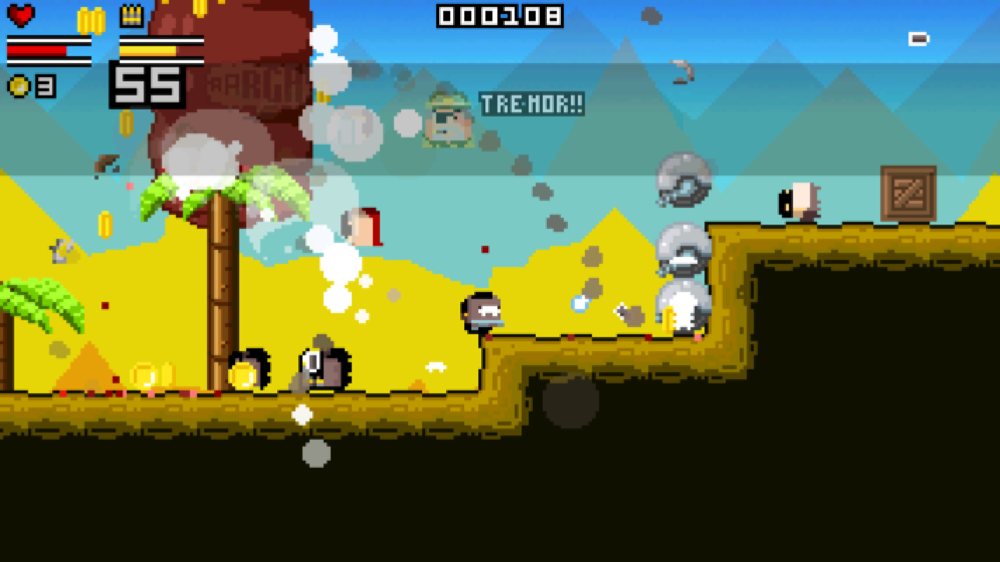
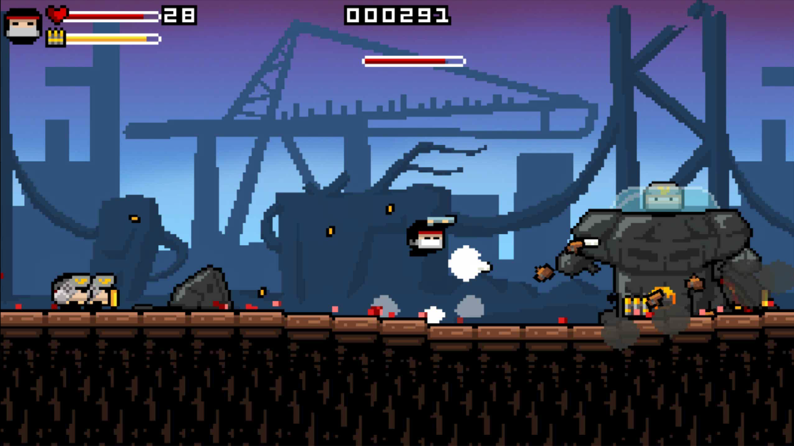
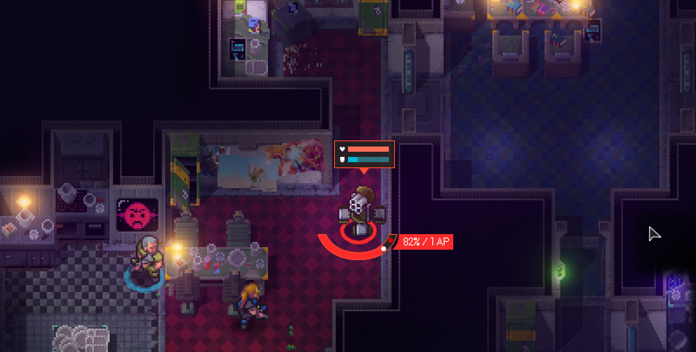
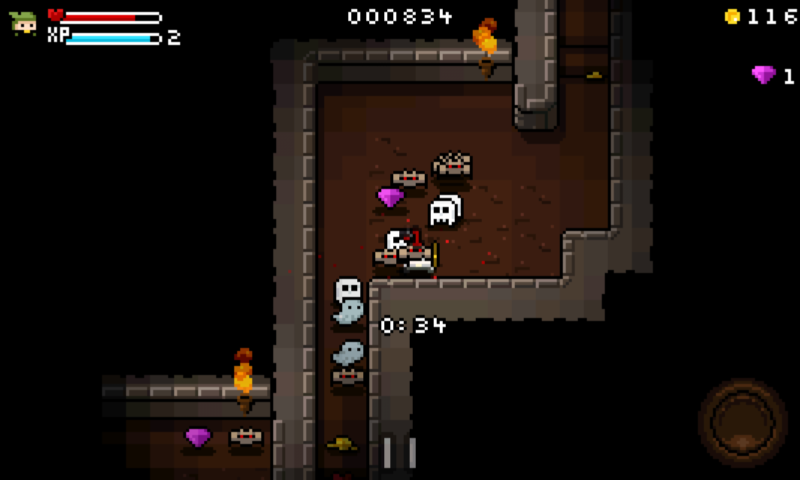
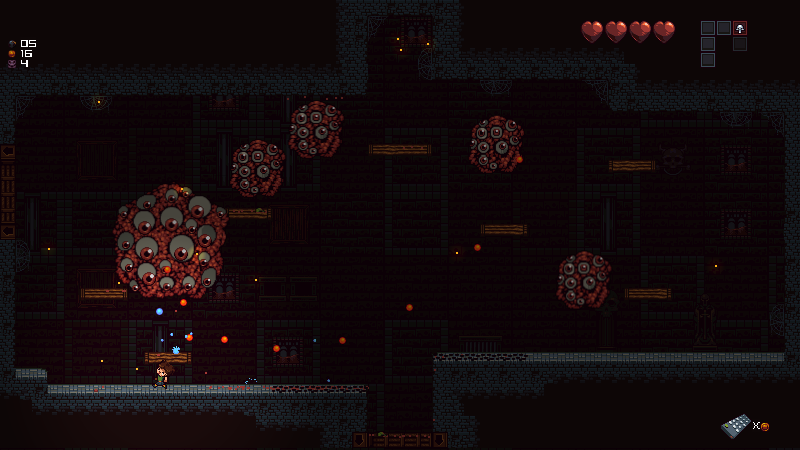
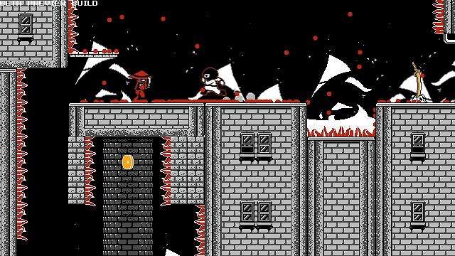
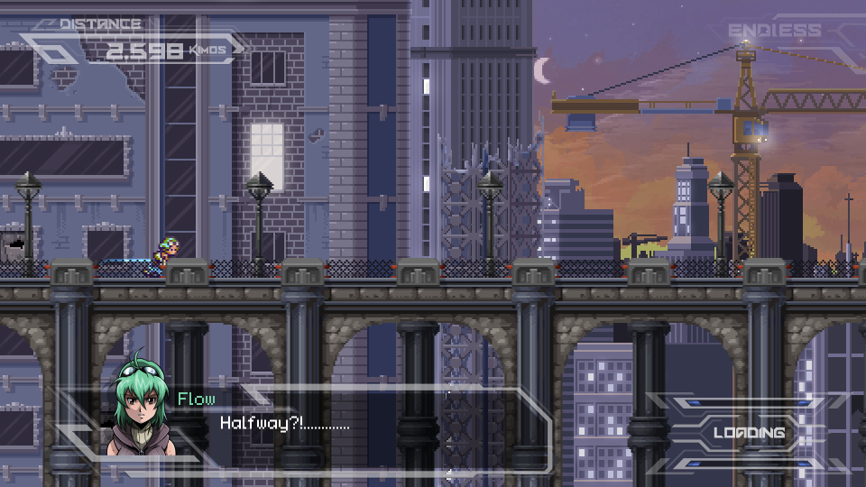
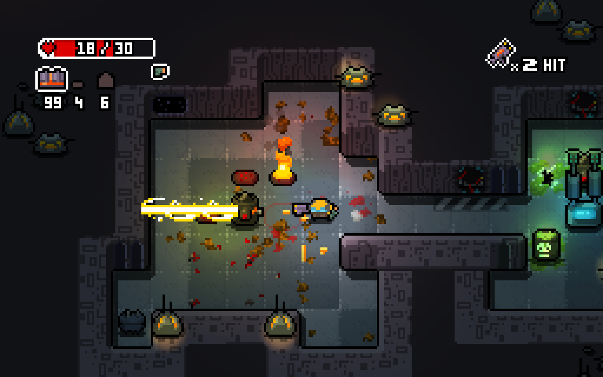

## Games using steamworks4j

A list of games released on Steam, in alphabetical order, which are known to utilize *steamworks4j*. Feel free to contact me if you like your game to be added (or removed).

---
### [Bard to the Future](http://store.steampowered.com/app/337110/)

Developer: [Battlebard Games][battlebardgames] 
Uses: achievements, user stats, leaderboards 

---
### [Gunslugs](http://store.steampowered.com/app/371890/)

Developer: [OrangePixel][orangepixel] 
Uses: achievements, leaderboards 

---
### [Gunslugs 2](http://store.steampowered.com/app/340750/)

Developer: [OrangePixel][orangepixel] 
Uses: achievements, leaderboards 

---
### [Halfway](http://store.steampowered.com/app/253150/)

Developer: [Robotality][robotality] 
Uses: achievements, user stats, remote storage, user-generated content 

*The game which I eventually started writing steamworks4j for.*

---
### [Heroes of Loot](http://store.steampowered.com/app/359280/)

Developer: [OrangePixel][orangepixel] 
Uses: achievements 

---
### [Lux Delux](http://store.steampowered.com/app/341950/)

Developer: [Sillysoft Games][sillysoft] 
Uses: achievements, user stats, leaderboards 

---
### [The Madness of Little Emma](http://store.steampowered.com/app/418150/)

Developer: [Bartosz Bojarowski][madnessoflittleemma] 
Uses: achievements, leaderboards 

---
### [Mute Crimson+](http://store.steampowered.com/app/384280/)

Developer: [Iced Lizard Games][icedlizardgames] 
Uses: achievements, remote storage 

---
### [Quarries of Scred](http://store.steampowered.com/app/346770/)

Developer: [Hammerspace Games][hammerspacegames] 
Uses: achievements 

---
### [RFLEX](http://store.steampowered.com/app/392020/)

Developer: [Wesley LaFerriere][rflex] 
Uses: achievements, remote storage, leaderboards 

---
### [Run or Die](http://store.steampowered.com/app/325150/)

Developer: [Team Flow][teamflow] 
Uses: achievements, user-generated content 

*I love the (unwitting?) Halfway reference. :-D*

---
### [Solar War](http://store.steampowered.com/app/340880/)

Developer: [Snipefish Entertainment][snipefish] 
Uses: achievements, remote storage 

---
### [Space Grunts](http://store.steampowered.com/app/371430/)

Developer: [OrangePixel][orangepixel] 
Uses: achievements, leaderboards 

---
### [Spermination](http://store.steampowered.com/app/363460/)

Developer: [Phr00t][phr00t] 
Uses: achievements 

*I don't even ...*

---
### [Spy Bugs](http://store.steampowered.com/app/366860/)

Developer: [Digital Soul Games][digitalsoulgames] 
Uses: achievements, user stats, leaderboards, gameserver, web api 

*The gameserver back-end for Spy Bugs is written in Java, and uses steamworks4j to interface with Steam services. Digital Soul Games' Francisco Bischoff contributed large parts of the game server and web API wrappers.*

[battlebardgames]: http://battlebardgames.com
[digitalsoulgames]: http://www.digitalsoulgames.org
[icedlizardgames]: http://icedlizardgames.com
[hammerspacegames]: http://www.quarriesofscred.com
[madnessoflittleemma]: http://madnessoflittleemma.com/
[orangepixel]: http://www.orangepixel.net
[phr00t]: http://www.phr00t.com
[robotality]: http://robotality.com
[rflex]: http://rflex-game.com
[sillysoft]: http://sillysoft.net
[snipefish]: http://solarwar.net
[teamflow]: http://www.runordiegame.com
