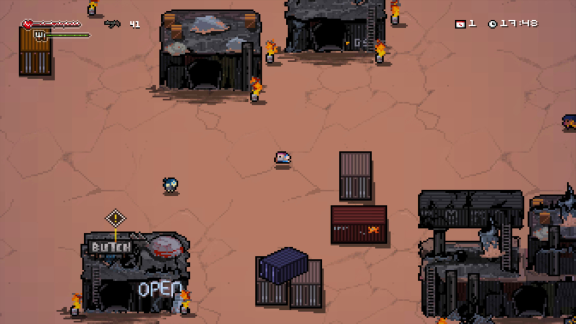
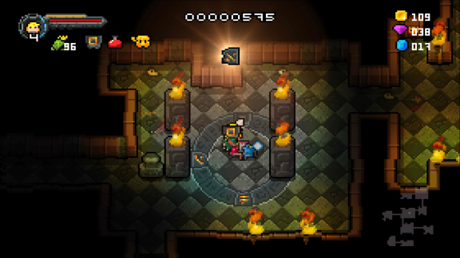
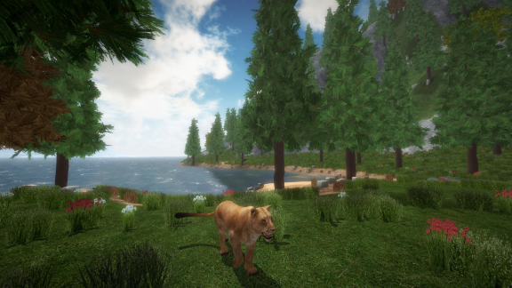
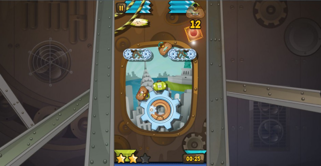
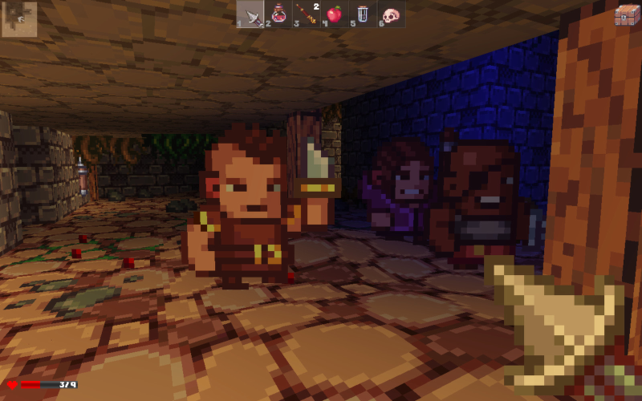
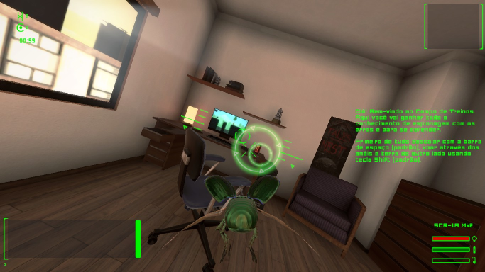

## Games using steamworks4j

### Robotality

The [Robotality][robotality] game I originally wrote *steamworks4j* for.

 [Halfway](http://store.steampowered.com/app/253150/)

### Most diligent user

One man army [OrangePixel][orangepixel] earned his special section because he churns out *steamworks4j*-powered quality games like no other.

 [Ashworld](http://store.steampowered.com/app/580320/)

---

 [Gunslugs](http://store.steampowered.com/app/371890/)

---

 [Gunslugs 2](http://store.steampowered.com/app/340750/)

---

 [Heroes of Loot](http://store.steampowered.com/app/359280/)

---

 [Heroes of Loot 2](http://store.steampowered.com/app/439880/)

---

 [Space Grunts](http://store.steampowered.com/app/371430/)

### Editor's choice

My - undoubtedly dictatorial - list of "favorite" games which look cool, and/or which I tried and enjoyed playing myself.

 [Alchemists Awakening](http://store.steampowered.com/app/431450/) by [Osaris Games](osarisgames)

 [Crazy Belts](http://store.steampowered.com/app/355510/) by [jemchicomac][jemchicomac]

---

 [Delver](http://store.steampowered.com/app/249630/) by 	[Priority Interrupt][priorityinterrupt]

---

 [The Madness of Little Emma](http://store.steampowered.com/app/418150/) by [Bartosz Bojarowski][madnessoflittleemma]

---

 [Mute Crimson+](http://store.steampowered.com/app/384280/) by [Iced Lizard Games][icedlizardgames]

---

 [Run or Die](http://store.steampowered.com/app/325150/) by [Team Flow][teamflow] (*I love the (unwitting?) Halfway reference. :-D*)

---

 [Spy Bugs](http://store.steampowered.com/app/366860/) by [Digital Soul Games][digitalsoulgames] (*Digital Soul Games' Francisco Bischoff contributed large parts of the game server and web API wrappers.*)

### Mentions

A list in alphabetical order, of other games I known to utilize *steamworks4j*. Feel free to contact me if you notice wrong information, or if you like your game to be added/removed.

| Title | Developer |
|---|---|
| [a nifty game](http://store.steampowered.com/app/591390/) | Pixel with Hat |
| [Age of Conquest IV](http://store.steampowered.com/app/314970/) | Noble Master LLC |
| [Alien Blitz](http://store.steampowered.com/app/434240/) | Jean-Baptiste Simillon |
| [AuroraRL](http://store.steampowered.com/app/437890/) | Sun Dogs |
| [Balrum](http://store.steampowered.com/app/424250/) | Balcony Team |
| [Bard to the Future](http://store.steampowered.com/app/337110/) | [Battlebard Games][battlebardgames] |
| [Battlestation: Harbinger](http://store.steampowered.com/app/396480/) | [Bugbyte Ltd][bugbyte] |
| [Biodrone_Battle](http://store.steampowered.com/app/377290/) | voodoosoft |
| [BossConstructor](http://store.steampowered.com/app/330100/) | [Mirko Seithe][mseithe] |
| [The Count Lucanor](http://store.steampowered.com/app/440880/) | [Baroque Decay][baroquedecay] |
| [Crown and Council](http://store.steampowered.com/app/444250/) | Mojang |
| [Dog Sled Saga](http://store.steampowered.com/app/286240/) | Trichotomy |
| [Don't Chat With Strangers](http://store.steampowered.com/app/533170/) | Bartosz Bojarowski |
| [The Dungeoning](http://store.steampowered.com/app/295870/) | Nick Donnelly |
| [Fantasy Tales Online](http://store.steampowered.com/app/442710/) | Cold Tea Studio |
| [Flat Path](http://store.steampowered.com/app/512740/) | GooDCrafter |
| [Hidden Dimensions 3](http://store.steampowered.com/app/531540/) | Stijn Van Cauter |
| [InfiniTrap: Ohio Jack and The Cup Of Eternity](http://store.steampowered.com/app/412230/) | [Shadebob Games][shadebobgames] |
| [Iron Armada](http://store.steampowered.com/app/581910/) | Drakeling Labs |
| [Lone Vessel](http://store.steampowered.com/app/687420/) | Cobalt Flow Studios |
| [Lux Delux](http://store.steampowered.com/app/341950/) | [Sillysoft Games][sillysoft] |
| [The Metronomicon: Slay The Dance Floor](http://store.steampowered.com/app/416790/) | Puuba |
| [MHRD](http://store.steampowered.com/app/576030/) | Funghisoft |
| [Nubs' Adventure](http://store.steampowered.com/app/401280/) | IMakeGames |
| [Prompt](http://store.steampowered.com/app/366590/) | Peter Gutenko |
| [qb](http://store.steampowered.com/app/601400/) | Armadillo Studios |
| [Quarries of Scred](http://store.steampowered.com/app/346770/) | [Hammerspace Games][hammerspacegames] |
| [RFLEX](http://store.steampowered.com/app/392020/) | [Wesley LaFerriere][rflex] |
| [Rising World](http://store.steampowered.com/app/324080/) | JIW-Games |
| [Senalux](http://store.steampowered.com/app/654580/) | Pixel with Hat |
| [Slay the Spire](http://store.steampowered.com/app/646570/) | Mega Crit Games |
| [Solar War](http://store.steampowered.com/app/340880/) | [Snipefish Entertainment][snipefish] |
| [Spaceport Hope](http://store.steampowered.com/app/394540/) | team BitClub |
| [Spermination](http://store.steampowered.com/app/363460/) | [Phr00t][phr00t] |
| [Super Pixalo](http://store.steampowered.com/app/347480/) | Philip Royer |
| [Tomb of Tyrants](http://store.steampowered.com/app/340360/) | Jake Huhman |

[baroquedecay]: http://www.thecountlucanor.com
[battlebardgames]: http://battlebardgames.com
[bugbyte]: http://bugbyte.fi
[digitalsoulgames]: http://www.digitalsoulgames.org
[icedlizardgames]: http://icedlizardgames.com
[hammerspacegames]: http://www.quarriesofscred.com
[jemchicomac]: http://www.jemchicomac.com
[madnessoflittleemma]: http://madnessoflittleemma.com/
[mseithe]: http://bossconstructor.com
[orangepixel]: http://www.orangepixel.net
[osarisgames]: http://www.osaris.net/
[phr00t]: http://www.phr00t.com
[priorityinterrupt]: http://www.delvergame.com/
[robotality]: http://robotality.com
[rflex]: http://rflex-game.com
[shadebobgames]: http://www.shadebob.org
[sillysoft]: http://sillysoft.net
[snipefish]: http://solarwar.net
[teamflow]: http://www.runordiegame.com
